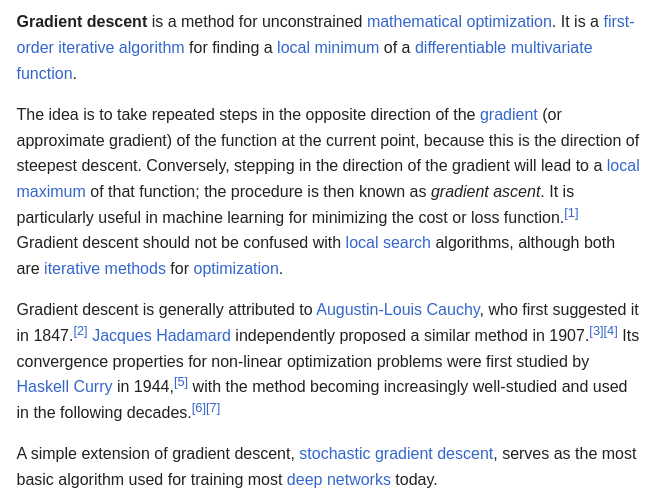
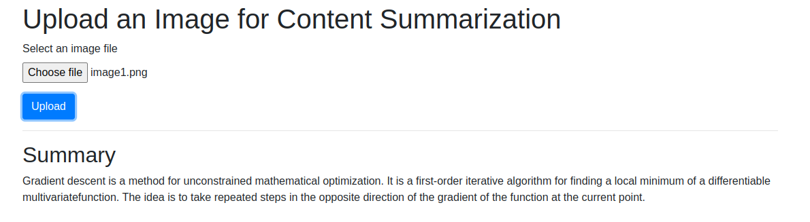

# Image Content Summarization

## Due to Limited computational power, I have used the BART (Bidirectional and Auto-Regressive Transformers) model, specifically the "bart-large-cnn" variant developed by META especially for text document images along with flask.


## Else the alternative could be Llava [NeurIPS'23 Oral] - [link](https://github.com/haotian-liu/LLaVA) or GOOGLE GEMINI VISION PRO or OpenAI for general purpose image content summarization.

### Installation

Set-up environment
```
conda create -n "summarize" python=3.8

conda activate summarize
```

Install other necessary Python packages
```
pip install flask pillow pytesseract transformers
```

```
sudo apt-get install tesseract-ocr
```

Clone this repository
```
git clone https://github.com/sayandebroy-csmi/image_content_summarize.git

cd image_content_summarize
```

Run the code
```
python app.py
```

Go to http://127.0.0.1:5000

RGB IMAGE


RESULT
